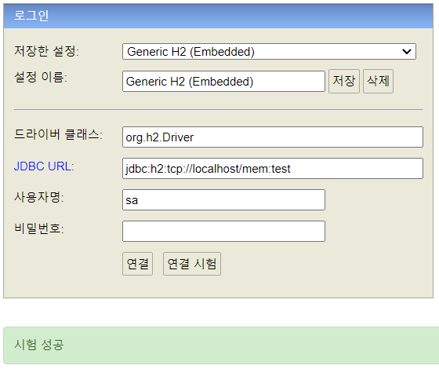

  
H2

## H2

버전 2.1.214 설치 
최초 jdbc url: `jdbc:h2:mem:testdb` 
tcp jdcb url: `jdbc:h2:tcp://localhost/mem:testdb` 

## [JDBC](docs/jdbc.md)

## [DataSource](docs/datasource.md)

## [SQL Mapper](docs/sqlmapper.md)

## [ORM](docs/orm.md)

## [Transaction](docs/transaction.md)

## [Transaction Abstraction](docs/transactionabstraction.md)

## [Transaction Synchronization](docs/transactionsync.md)

## [TransactionTemplate](docs/transactiontemplate.md)

## [Transaction AOP](docs/transactionaop.md)

## [Exception](docs/exception.md)

## [Spring Exception](docs/springexception.md)

## [JdbcTemplate](docs/jdbctemplate.md)