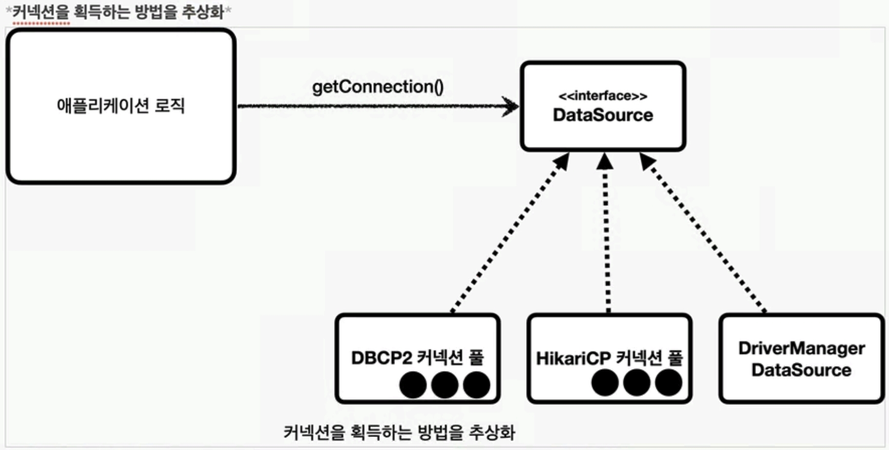

## DataSource

커넥션을 획득하는 방법을 추상화<br>
DriverManager에 비해 데이터베이스 연결을 설정하는 더 고급 방식<br>
커넥션 풀을 통해 성능을 향상시킬 수 있다<br>

```java
public interface DataSource {
    Connection getConnection() throws SQLException;
}
```


대부분의 커넥션 풀은 이미 DataSource를 구현해서 사용하고 있다<br>
개발자는 DataSource 인터페이스를 의존하는 코드를 작성한다<br>

기존 DriverManager 소스를 DataSource 로 변경하는 수고를 줄이기 위해 <br>스프링은 DriverManagerDataSource 구현 클래스를 제공한다<br>
DriverManagerDataSource를 이용하면 DriverManager를 이용해서 커넥션을 생성하므로 간단한 연결에만 사용한다

DataSource를 생성하면 커넥션 풀이 생성되어 다음부터는 풀에서 꺼내 사용하면 된다<br>
이러한 이점으로 설정정보를 별도로 관리할 수 있다 -> yml 버전별 관리<br>

```java
    @Test
    void driverManagerDataSource() throws SQLException {
        DriverManagerDataSource dataSource = new DriverManagerDataSource(URL, USERNAME, PASSWORD);
        useDataSource(dataSource);
    }

    private void useDataSource(DataSource dataSource) throws SQLException {
        Connection con1 = dataSource.getConnection();
        Connection con2 = dataSource.getConnection();
        log.info("connection={}, class={}", con1, con1.getClass());
        log.info("connection={}, class={}", con2, con2.getClass());
        // connection=conn0: url=jdbc:h2:tcp://localhost/mem:testdb user=SA, class=class org.h2.jdbc.JdbcConnection
    }
```
스프링 부트에서는 설정파일에서 데이터 소스를 설정할 수 있다<br>
`spring-boot-starter-jdbc`의존성이 프로젝트에 포함되어 있으면<br>
애플리케이션 시작 시 자동으로 데이터 소스를 구성하고 스프링 컨테이너에 등록한다<br>
```yml
spring:
  datasource:
    url: jdbc:mysql://localhost:3306/mydatabase
    username: dbuser
    password: dbpassword
    driver-class-name: com.mysql.cj.jdbc.Driver
  jpa:
    hibernate:
      ddl-auto: update
    show-sql: true
```

스프링 부트는 기본적으로 HikariCP 커넥션 풀 라이브러리를 사용한다<br>
별도 설정이 없다면 기본값은 아래와 같다
```properties
spring.datasource.hikari.minimum-idle: 10
spring.datasource.hikari.maximum-pool-size: 10
spring.datasource.hikari.connection-timeout: 30000 (30초)
spring.datasource.hikari.idle-timeout: 600000 (10분)
spring.datasource.hikari.max-lifetime: 1800000 (30분)
```

[Back to main README](../README.md)