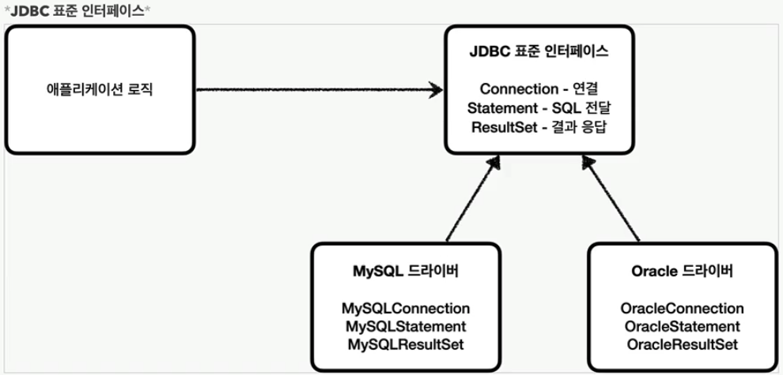

## JDBC

Java Database Connectivity<br>
수많은 데이터베이스에 접근하기 위한 데이터베이스에 종속적인 코드의 단점을 없애고<br> 표준 API를 통해 여러 데이터베이스에 접근하도록 한다

>jdbc 주요기능
- db 연결
- 쿼리 실행
- ResultSet 처리
- 트랜잭션 관리
- 메타데이터 접근
```java
import java.sql.Connection;
import java.sql.DriverManager;
import java.sql.ResultSet;
import java.sql.Statement;

public class JdbcExample {
    public static void main(String[] args) {
        // JDBC URL, 사용자명, 비밀번호를 설정
        String jdbcUrl = "jdbc:mysql://localhost:3306/mydatabase";
        String username = "myusername";
        String password = "mypassword";

        try {
            // 데이터베이스 연결을 설정
            Connection connection = DriverManager.getConnection(jdbcUrl, username, password);

            // Statement 객체를 생성: sql쿼리 보내고 결과를 받는 역할
            Statement statement = connection.createStatement();

            // SQL 쿼리를 실행
            ResultSet resultSet = statement.executeQuery("SELECT * FROM mytable");

            // 결과를 처리
            while (resultSet.next()) {
                System.out.println("Column1: " + resultSet.getString("column1"));
                System.out.println("Column2: " + resultSet.getInt("column2"));
            }

            // 자원을 해제
            resultSet.close();
            statement.close();
            connection.close();
        } catch (Exception e) {
            e.printStackTrace();
        }
    }
}
```
- executeQuery<br>
  SELECT 쿼리를 실행하여 데이터베이스로부터 결과 집합(ResultSet)을 가져온다
```java
String sql = "SELECT * FROM mytable";
ResultSet resultSet = statement.executeQuery(sql);
```
- executeUpdate<br>
  INSERT, UPDATE, DELETE와 같은 데이터베이스를 수정하는 쿼리를 실행한다
```java
String sql = "UPDATE mytable SET column1 = 'value' WHERE column2 = 123";
int rowsAffected = statement.executeUpdate(sql);
```

jdbc 4.2 예제
```java
    public static void main(String[] args) {
        String jdbcUrl = "jdbc:mysql://localhost:3306/mydatabase";
        String username = "myusername";
        String password = "mypassword";

        try (Connection connection = DriverManager.getConnection(jdbcUrl, username, password)) {
            String sql = "SELECT id, name, birth_date FROM users WHERE birth_date = ?";
            try (PreparedStatement preparedStatement = connection.prepareStatement(sql)) {
                preparedStatement.setObject(1, LocalDate.of(1990, 1, 1));

                try (ResultSet resultSet = preparedStatement.executeQuery()) {
                    while (resultSet.next()) {
                        int id = resultSet.getInt("id");
                        String name = resultSet.getString("name");
                        LocalDate birthDate = resultSet.getObject("birth_date", LocalDate.class);

                        System.out.println("ID: " + id + ", Name: " + name + ", Birth Date: " + birthDate);
                    }
                }
            }
        } catch (SQLException e) {
            e.printStackTrace();
        }
    }
```

[Back to main README](../README.md)