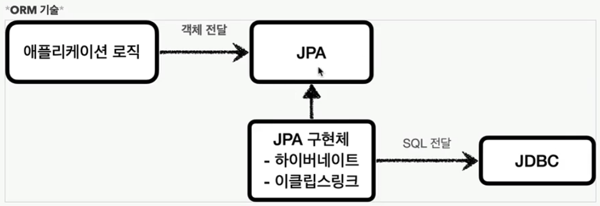

## ORM


객체를 RDBMS 테이블과 매핑시켜주는 기술<br>
ORM이 개발자 대신 동적으로 sql을 만들어 준다<br>
대표적인 예 - `JPA`, `Hibernate`

### Hibernate
객체 관계 매핑(ORM) 프레임워크
```java
import org.hibernate.Session;
import org.hibernate.SessionFactory;
import org.hibernate.cfg.Configuration;

public class HibernateExample {
    public static void main(String[] args) {
        Configuration configuration = new Configuration().configure();
        SessionFactory sessionFactory = configuration.buildSessionFactory();

        try (Session session = sessionFactory.openSession()) {
            session.beginTransaction();
            
            User user = new User();
            user.setName("John Doe");
            user.setEmail("john.doe@example.com");

            session.save(user);
            session.getTransaction().commit();
        }
    }
}

// User.java
import javax.persistence.Entity;
import javax.persistence.Id;

@Entity
public class User {
    @Id
    private Long id;
    private String name;
    private String email;

    // getters and setters
}
```

### JPA
JPA는 자바 표준 ORM API<br>
대표적인 구현체가 `Hibernate`
```java
import javax.persistence.EntityManager;
import javax.persistence.EntityManagerFactory;
import javax.persistence.Persistence;

public class JPAExample {
    public static void main(String[] args) {
        EntityManagerFactory emf = Persistence.createEntityManagerFactory("my-persistence-unit");
        EntityManager em = emf.createEntityManager();

        em.getTransaction().begin();
        
        User user = new User();
        user.setName("Jane Doe");
        user.setEmail("jane.doe@example.com");

        em.persist(user);
        em.getTransaction().commit();

        em.close();
        emf.close();
    }
}

// User.java
import javax.persistence.Entity;
import javax.persistence.Id;

@Entity
public class User {
    @Id
    private Long id;
    private String name;
    private String email;

    // getters and setters
}
```

### Spring Data JPA

JPA를 기반으로 하여, 데이터 접근 계층의 구현을 단순화하는 프레임워크<br>
리포지토리 인터페이스를 정의하는 것만으로 CRUD 작업을 쉽게 구현
```java
import org.springframework.beans.factory.annotation.Autowired;
import org.springframework.boot.CommandLineRunner;
import org.springframework.boot.SpringApplication;
import org.springframework.boot.autoconfigure.SpringBootApplication;

@SpringBootApplication
public class SpringDataJpaExample implements CommandLineRunner {
    @Autowired
    private UserRepository userRepository;

    public static void main(String[] args) {
        SpringApplication.run(SpringDataJpaExample.class, args);
    }

    @Override
    public void run(String... args) throws Exception {
        User user = new User();
        user.setName("Bob");
        user.setEmail("bob@example.com");
        userRepository.save(user);
        
        userRepository.findAll().forEach(System.out::println);
    }
}

// UserRepository.java
import org.springframework.data.jpa.repository.JpaRepository;

public interface UserRepository extends JpaRepository<User, Long> {
}

// User.java
import javax.persistence.Entity;
import javax.persistence.Id;

@Entity
public class User {
    @Id
    private Long id;
    private String name;
    private String email;

    // getters and setters
}
```

[Back to main README](../README.md)