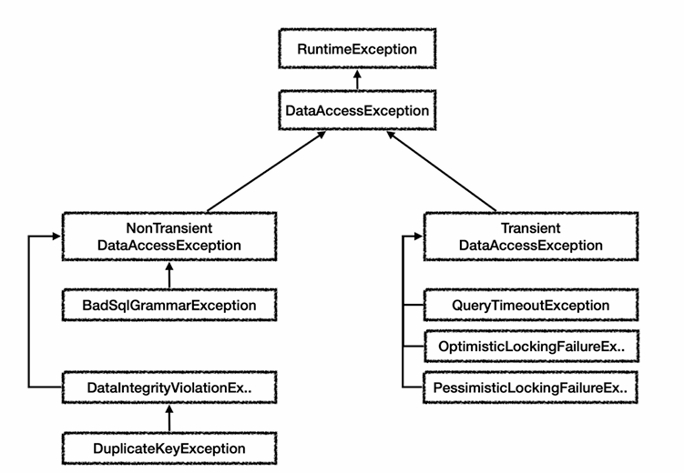
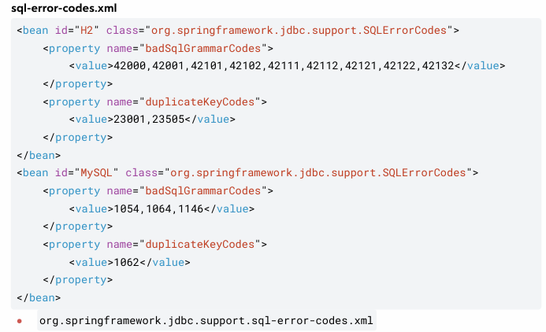

## Spring Exception

### DataAccessException
특정 데이터 액세스 기술에 종속되지 않고, 예외를 일관되게 처리할 수 있도록 한다


스프링에서는 JDBC, JPA 등 여러 기술에서 발생할 수 있는 예외를 `DataAccessException`으로 추상화한다<br>
- `Transient`: 예외는 일시적 DB문제로 타임아웃이나 락으로 잠시 뒤 다시 요청하면 해결되는 가능성이 있다<br>
- `NonTransient`: 예외는 SQL문법 오류, 제약조건 위배 등에 해당된다<br>

이전 md에서 예외코드마다 익셉션을 정의해서 처리했는데 너무 방대한 에러코드가 있으므로 현실성이 없다<br>
스프링의 예외 추상화를 통해서 이러한 다양한 예외를 편하게 처리하는편이 좋다<br>

JdbcTempalte, Mybatis, Jpa등을 이용한다면 스프링은 데이터 접근 예외를 `DataAccessException`로 추상화하여 반환한다

### SQLExceptionTranslator
직접 커넥션을 연결했을 경우 스프링 예외로 바꿀 수 있다
```java
import org.springframework.jdbc.support.SQLErrorCodeSQLExceptionTranslator;
import org.springframework.jdbc.support.SQLStateSQLExceptionTranslator;
import org.springframework.jdbc.support.SQLExceptionTranslator;
import org.springframework.jdbc.support.JdbcUtils;

import java.sql.Connection;
import java.sql.DriverManager;
import java.sql.PreparedStatement;
import java.sql.SQLException;

@Slf4j
public class DirectJdbcWithSpringExceptionHandling {
    private static final String URL = "jdbc:mysql://localhost:3306/mydatabase";
    private static final String USER = "myuser";
    private static final String PASSWORD = "mypassword";

    public static void main(String[] args) {
        Connection connection = null;
        PreparedStatement preparedStatement = null;
        SQLExceptionTranslator exceptionTranslator = new SQLErrorCodeSQLExceptionTranslator("mysql");

        try {
            connection = DriverManager.getConnection(URL, USER, PASSWORD);
            String sql = "INSERT INTO my_table (data) VALUES (?)";
            preparedStatement = connection.prepareStatement(sql);
            preparedStatement.setString(1, "some data");
            preparedStatement.executeUpdate();
        } catch (SQLException e) {
            // SQLException을 DataAccessException으로 변환
            DataAccessException dae = exceptionTranslator.translate("Insert", sql , e);
            log.info("Data access error: " + dae.getMessage());
            dae.printStackTrace();
        } finally {
            JdbcUtils.closeResultSet(rs);
            JdbcUtils.closeStatement(stmt);
            JdbcUtils.closeConnection(conn);
        }
    }
}
```
### sql-error-codes.xml
각 DB마다 다양한 에러코드는 스프링의 `sql-error-codes.xml`를 참고하여 정의된다


[Back to main README](../README.md)