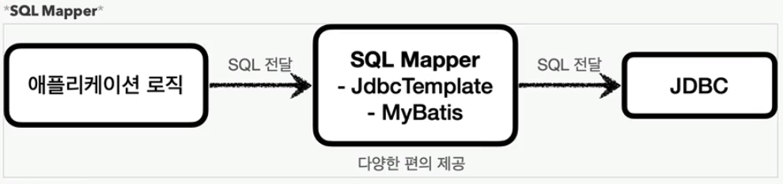

## [SQL Mapper](docs/sqlmapper.md)
객체지향 프로그래밍 언어와 관계형 데이터베이스 간의 매핑을 간편하게 해주는 기술

jdbc를 편리하게 사용하도록 도와준다<br>
sql 결과를 객체로 변환<br>
jdbc 보일러플레이트 코드를 줄여준다<br>
대표적인 예 - `JdbcTemplate`, `Mybatis`

### jdbcTemplate
```java
import org.springframework.jdbc.core.JdbcTemplate;
import org.springframework.jdbc.datasource.DriverManagerDataSource;

import java.util.List;

public class SpringJDBCExample {
    public static void main(String[] args) {
        DriverManagerDataSource dataSource = new DriverManagerDataSource();
        dataSource.setDriverClassName("com.mysql.cj.jdbc.Driver");
        dataSource.setUrl("jdbc:mysql://localhost:3306/mydatabase");
        dataSource.setUsername("myusername");
        dataSource.setPassword("mypassword");

        JdbcTemplate jdbcTemplate = new JdbcTemplate(dataSource);

        String sql = "SELECT name FROM users";
        List<String> names = jdbcTemplate.queryForList(sql, String.class);

        for (String name : names) {
            System.out.println(name);
        }
    }
}
```
스프링 부트의 `spring-boot-starter-jdbc` 의존성이 스프링 설정정보를 보고<br> 
`DataSourceAutoConfiguration`같은 자동 구성 클래스를 통해 `DataSource`를 설정한다<br>
스프링 부트의 `DataSourceAutoConfiguration` 클래스가 설정파일에서 관련 설정을 읽어와 적절한 `DataSource` 객체(커넥션 풀 포함)를 자동으로 만들어준다<br>
- application.properties
```properties
spring.datasource.url=jdbc:mysql://localhost:3306/mydatabase
spring.datasource.username=myusername
spring.datasource.password=mypassword
spring.datasource.driver-class-name=com.mysql.cj.jdbc.Driver
```
```java
import org.springframework.beans.factory.annotation.Autowired;
import org.springframework.jdbc.core.JdbcTemplate;
import org.springframework.stereotype.Service;

@Service
public class UserService {

    @Autowired
    private JdbcTemplate jdbcTemplate;

    public void addUser(String name, String email) {
        String sql = "INSERT INTO users (name, email) VALUES (?, ?)";
        jdbcTemplate.update(sql, name, email);
    }

    public void getAllUsers() {
        String sql = "SELECT * FROM users";
        List<Map<String, Object>> users = jdbcTemplate.queryForList(sql);
        for (Map<String, Object> user : users) {
            System.out.println(user);
        }
    }
}
```
### DataSource
스프링 부트는 DataSource빈을 생성하고 관리하므로 JdbcTemplate을 주입받을 때 DataSource를 넣어서 반환해준다<br>
또는 아래처럼 명시적으로 스프링 부트의 DataSource등록을 구현할 수 있다
```java
import org.springframework.context.annotation.Bean;
import org.springframework.context.annotation.Configuration;
import org.springframework.jdbc.core.JdbcTemplate;
import javax.sql.DataSource;

@Configuration
public class AppConfig {

    @Bean
    public JdbcTemplate jdbcTemplate(DataSource dataSource) {
        return new JdbcTemplate(dataSource);
    }
}
```
### Mybatis
```java
import org.apache.ibatis.session.SqlSession;
import org.apache.ibatis.session.SqlSessionFactory;
import org.apache.ibatis.session.SqlSessionFactoryBuilder;

import java.io.Reader;

public class MyBatisExample {
    public static void main(String[] args) throws Exception {
        Reader reader = Resources.getResourceAsReader("mybatis-config.xml");
        SqlSessionFactory sqlSessionFactory = new SqlSessionFactoryBuilder().build(reader);
        
        try (SqlSession session = sqlSessionFactory.openSession()) {
            UserMapper mapper = session.getMapper(UserMapper.class);
            User user = new User(); // POJO
            user.setName("Alice");
            user.setEmail("alice@example.com");
            mapper.insertUser(user);
            session.commit();
        }
    }
}

// UserMapper.java
public interface UserMapper {
    void insertUser(User user);
}
```
### @Mapper, @MapperScan
스프링과 통합하여 사용하면 매퍼 인터페이스 관리를 추상화해준다<br>
`spring-boot-starter` 의존성을 추가하고 `@Mapper`를 사용하면 Mybatis가 자동으로 매퍼 인터페이스의 구현체를 생성한다


```xml
<!-- src/main/resources/mapper/UserMapper.xml -->
<!DOCTYPE mapper
        PUBLIC "-//mybatis.org//DTD Mapper 3.0//EN"
        "http://mybatis.org/dtd/mybatis-3-mapper.dtd">
<mapper namespace="com.example.mapper.UserMapper">
    <insert id="insertUser" parameterType="User">
        INSERT INTO users (name, email) VALUES (#{name}, #{email})
    </insert>

    <select id="findAllUsers" resultType="User">
        SELECT id, name, email FROM users
    </select>
</mapper>

```
```java
@Mapper
public interface UserMapper {

    @Insert("INSERT INTO users(name, email) VALUES(#{name}, #{email})")
    void insertUser(User user);

    @Select("SELECT * FROM users")
    List<User> findAllUsers();
}
```
```java
import org.springframework.boot.SpringApplication;
import org.springframework.boot.autoconfigure.SpringBootApplication;
import org.mybatis.spring.annotation.MapperScan;

@SpringBootApplication
@MapperScan("com.example.mapper") // 매퍼 인터페이스가 위치한 패키지
public class MyBatisApplication {
    public static void main(String[] args) {
        SpringApplication.run(MyBatisApplication.class, args);
    }
}
```
### DataSource 
MyBatis도 내부적으로 DataSource를 의존한다<br>
코드로 확인해보면 아래와 같다
```java
import org.apache.ibatis.session.SqlSessionFactory;
import org.mybatis.spring.SqlSessionFactoryBean;
import org.mybatis.spring.annotation.MapperScan;
import org.springframework.context.annotation.Bean;
import org.springframework.context.annotation.Configuration;
import org.springframework.core.io.support.PathMatchingResourcePatternResolver;

import javax.sql.DataSource;

@Configuration
@MapperScan("com.example.demo.mapper")
public class MyBatisConfig {

    @Bean
    public SqlSessionFactory sqlSessionFactory(DataSource dataSource) throws Exception {
        SqlSessionFactoryBean sessionFactory = new SqlSessionFactoryBean();
        sessionFactory.setDataSource(dataSource);
        sessionFactory.setMapperLocations(
                new PathMatchingResourcePatternResolver().getResources("classpath:mappers/*.xml")
        );
        return sessionFactory.getObject();
    }
}
```
SqlSessionFactory는 MyBatis 핵심 인터페이스로 SqlSessionFactoryBean을 이용하여 SqlSession을 생성하는 역할을 한다<br>


[Back to main README](../README.md)
