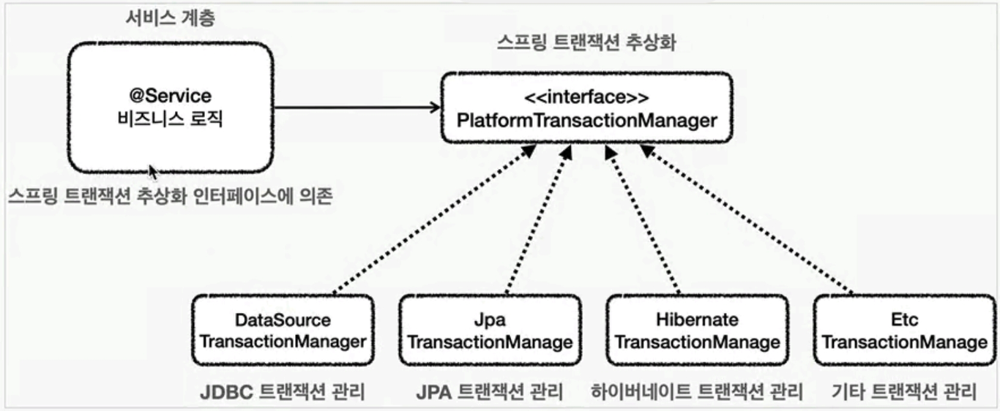

## Transaction 추상화

구현하는 기술마다 트랜잭션을 사용하는 방법이 다르다
- JDBC `con.setAutoCommit(false)`
- JPA `transaction.begin()`<br>

JPA 트랜잭션 예시 코드
```java
import javax.persistence.*;

public class JpaEntityTransactionExample {

    public static void main(String[] args) {
        EntityManagerFactory emf = Persistence.createEntityManagerFactory("examplePU");
        EntityManager em = emf.createEntityManager();
        EntityTransaction et = em.getTransaction();

        try {
            et.begin();

            ExampleEntity entity1 = new ExampleEntity();
            entity1.setName("Alice");
            em.persist(entity1);

            ExampleEntity entity2 = new ExampleEntity();
            entity2.setName("Bob");
            em.persist(entity2);

            entity1.setName("Charlie");
            em.merge(entity1);

            et.commit();

        } catch (Exception e) {
            e.printStackTrace();
            if (et.isActive()) {
                et.rollback();
            }
        } finally {
            em.close();
            emf.close();
        }
    }
}
```
1. xml을 참고하여 `EntityManager`를 생성하는 방법
```xml
<persistence xmlns="http://xmlns.jcp.org/xml/ns/persistence" version="2.2">
    <persistence-unit name="examplePU">
        <provider>org.hibernate.jpa.HibernatePersistenceProvider</provider>
        <class>com.example.ExampleEntity</class>
        <properties>
            <property name="javax.persistence.jdbc.url" value="jdbc:mysql://localhost:3306/exampledb"/>
            <property name="javax.persistence.jdbc.user" value="username"/>
            <property name="javax.persistence.jdbc.password" value="password"/>
            <property name="javax.persistence.jdbc.driver" value="com.mysql.cj.jdbc.Driver"/>
            <property name="hibernate.dialect" value="org.hibernate.dialect.MySQLDialect"/>
            <property name="hibernate.hbm2ddl.auto" value="update"/>
        </properties>
    </persistence-unit>
</persistence>
```
2. yml을 참고하여 `EntityManager`를 생성
```yml
spring:
  datasource:
    url: jdbc:mysql://localhost:3306/exampledb
    username: username
    password: password
    driver-class-name: com.mysql.cj.jdbc.Driver
  jpa:
    hibernate:
      ddl-auto: update
    properties:
      hibernate:
        dialect: org.hibernate.dialect.MySQLDialect
```
스프링 부트에서는 위 설정으로 `EntityManagerFactory`를 구성한다<br>
`JpaRepository`인터페이스로 DB작업을 할 수 있다
```java
import org.springframework.data.jpa.repository.JpaRepository;

public interface ExampleRepository extends JpaRepository<ExampleEntity, Long> {
}
```
```java
import org.springframework.beans.factory.annotation.Autowired;
import org.springframework.stereotype.Service;
import org.springframework.transaction.annotation.Transactional;

@Service
public class ExampleService {
    @Autowired
    private ExampleRepository repository;

    @Transactional
    public void performDatabaseOperations() {
        ExampleEntity entity = new ExampleEntity();
        entity.setName("Alice");
        repository.save(entity);

        entity.setName("Charlie");
        repository.save(entity);
    }
}
```
### 추상화를 해야하는 이유
만약에 JDBC 기술을 사용하다가 JPA 기술로 변경하게 되면 서비스 계층의 코드도 JPA 기술을 사용하도록 수정해야 하는 상황이 발생한다<br>
트랜잭션 기능을 추상화하여 코드 변경의 문제를 해결한다<br>
```java
public interface TxManaber {
    bigin();
    commit();
    rollback();
}
```
추상화된 트랜잭션 인터페이스를 서비스가 의존하도록 한다<br>
스프링은 이러한 트랜잭션 추상화 기술을 제공한다<br>
### PlatformTransactionManager
Spring의 트랜잭션 관리를 위한 핵심 인터페이스<br>
이 인터페이스를 구현한 객체는 데이터베이스 연결과 같은 리소스에 대한 트랜잭션을 시작하고, 커밋 또는 롤백을 수행한다

`PlatformTransactionManager`는 아래 3개의 메서드를 가지고 있다<br>
- `getTransaction()`: 트랜잭션을 시작, 이미 트랜잭션이 있다면 참여
- `commit()`
- `rollback()`<br>


[Back to main README](../README.md)