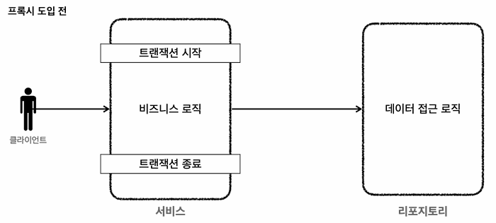
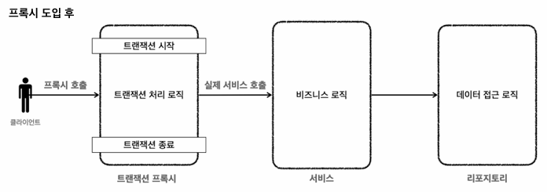

## Transaction AOP
기존 트랜잭션 관리는 비즈니스 로직과 트랜잭션이 하나의 클래스에서 함께 존재했다<br>


스프링 AOP를 통해 프록시를 도입하면 트랜잭션과 비즈니스로직을 분리할 수 있다<br>

트랜잭션 프록시 코드 예시
```java
public class TransactionProxy {
    // 비즈니스 로직에서 트랜잭션을 제거, 현재 클래스에서만 트랜잭션을 관리
    private MemberService target;
    
    public void logic() {
         //트랜잭션 시작
        TransactionStatus status = transactionManager.getTransaction(..);
        try {
            //실제 대상 호출
            target.logic();
            transactionManager.commit(status); //성공시 커밋
        } catch (Exception e) {
            transactionManager.rollback(status); //실패시 롤백
            throw new IllegalStateException(e);
        }
    }
}
```
트랜잭션 프록시가 발동하면 서비스 로직을 상속한 프록시를 생성 후 프록시 클래스에서 트랜잭션 처리를 하게 된다<br>
스프링에서는 `@Transactional` 어노테이션으로 트랜잭션 프록시를 적용한다

### 테스트 코드
```java
@Configuration
@Profile("test")
public class TestDatabaseConfig {
    @Bean
    public DataSource dataSource() {
        return DataSourceBuilder.create()
            .url("jdbc:h2:mem:testdb;DB_CLOSE_DELAY=-1")
            .username("sa")
            .password("")
            .driverClassName("org.h2.Driver")
            .build();
    }
    
    @Bean
    PlatformTransactionManager transactionManager() {
        return new DataSourceTransactionManager(dataSource());
    }
    
    @Bean
    MemberRepository memberRepository() {
        return new MemberRepository(dataSource());
    }
    
    @Bean
    MemberService memberService() {
        return new MemberService(memberRepository());
    }
}
```
`@Profile("test")` 를 사용하거나 `@TestConfiguration` 을 사용한다
```java
//import static org.assertj.core.api.Assertions.assertThat;
import org.assertj.core.api.Assertions;

@SpringBootTest
@ActiveProfiles("test")
@Transacnional // 테스트 완료 후 자동으로 롤백
public class MyServiceTest {
    @Autowired
    private MyService myService;

    @Test
    public void testMyServiceMethod() {
        // 테스트 코드 작성
    }
    
    @Test
    void AopCheck() {
        log.info("memberService class={}", memberService.getClass());
        log.info("memberRepository class={}", memberRepository.getClass());
        Assertions.assertThat(AopUtils.isAopProxy(memberService)).isTrue();
        Assertions.assertThat(AopUtils.isAopProxy(memberRepository)).isFalse();
    }
}

```
> @RunWith(SpringRunner.class)

JUnit 4 환경에서 사용<br>
스프링 테스트 컨텍스트를 JUnit 4 테스트에 통합<br>
애플리케이션 컨텍스트를 캐싱하여 여러 테스트 메서드가 동일한 컨텍스트를 공유할 수 있도록 하여 테스트 속도를 향상<br>
```java
@RunWith(SpringRunner.class)
@SpringBootTest
public class MyTest { ... }
```

> @ExtendWith(SpringExtension.class)

JUnit 5 (Jupiter) 환경에서 사용<br>
스프링 테스트 컨텍스트를 JUnit 5 테스트에 통합<br>
테스트 컨텍스트를 확장하고 트랜잭션 기능을 관리<br>
```java
@ExtendWith(SpringExtension.class)
@SpringBootTest
public class MyTest { ... }
```

스프링 부트에서는 ?<br>
대부분의 경우 `@SpringBootTest`만 붙여도 자동으로 확장이 적용됨(`@ExtendWith` 생략 가능)<br>

- 서비스 로직만 테스트 할 경우

```java
@ExtendWith(SpringExtension.class)
class MyServiceTest {
    @Autowired
    MyService myService;

    @Test
    void testBiz() {
        myService.doSomething();
    }
}
```

### 정리
1. 트랜잭션 AOP는 서비스 로직을 상속한 프록시 클래스를 만든다<br>
2. 이때 컨테이너에 등록된 트랜잭션 매니저를 통해 데이터소스로부터 커넥션을 생성한다<br>
3. 커넥션은 트랜잭션 동기화 매니저에 커넥션을 보관된다<br>
4. 데이터 접근 계층에서는 트랜잭션 동기화 커넥션을 획득 후 DB와 통신을 한다<br>
5. 작업이 완료되면 커넥션은 종료되지 않고 트랜잭션 통기화 매니저로 반환된다<br>
6. 모든 서비스 로직이 종료되면 DB에 커밋 명령을 보낸 후 트랜잭션이 종료된다

선언적 트랜잭션 관리를 통해 트랜잭션 코드를 비즈니스 로직에서 분리할 수 있게 된다

[Back to main README](../README.md)
