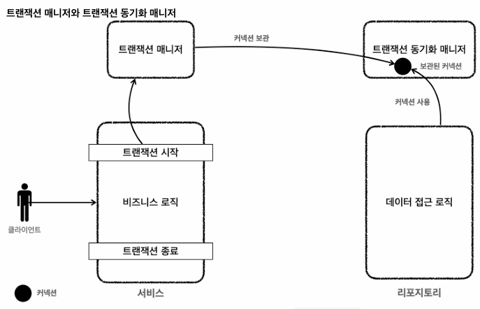

## Transaction 동기화

스프링은 트랜잭션 동기화 매니저를 제공한다<br>
이것은 `ThreadLocal`을 사용하여 커넥션을 동기화한다<br>

> 동작 흐름

1. 트랜잭션 매니저가는 데이터 소소를 통해 가져온 커넥셔을 트랜잭션 동기화 매니저에 보관한다<br>
2. 데이터에 접근하는 리포지토리는 동기화 매니저에 저장된 커넥션을 꺼내 사용한다<br>
3. 트랜잭션이 종료되면 트랜잭션 매니저는 동기화 매니저에 보관된 커넥션을 통해 트랜잭션을 종료하고, 커넥션을 닫는다<br>

### TransactionSynchronizationManager
Spring 프레임워크 내에서 트랜잭션 관리 및 리소스 동기화를 위한 중심적인 역할을 하는 유틸리티 클래스<br>
이 매니저는 트랜잭션과 관련된 리소스(예: 데이터베이스 연결, 세션 정보 등)를 현재 스레드와 연결하고,<br>
트랜잭션 생명주기 동안 이 리소스들을 관리하는 데 사용한다<br>


이 동기화 매니저는 `ThreadLocal`을 사용하여 각 스레드별로 리소스와 트랜잭션 정보를 독립적으로 유지한다<br>
`ThreadLocal`은 Spring Security에서 사용자 인증 정보를 전파, TransactionManager에서 트랜잭션 컨텍스트를 전파하는데 사용한다<br>
`ThreadLocal`의 사용으로 2가지 장점이 생긴다<br>
- 스레드 안전성
- 데이터 격리

### DataSourceUtils
`DataSource`에서 `Connection`을 가져오거나 관리할 때 사용, 트랜잭션 중인 Connection을 적절히 관리한다<br>
`DataSourceUtils`를 사용한 리포지토리의 구조는 아래처럼 된다
```java
import org.springframework.jdbc.datasource.DataSourceUtils;

Connection conn = null;
try {
    conn = DataSourceUtils.getConnection(dataSource);
    // 데이터베이스 작업 수행
} catch (SQLException e) {
    // 예외 처리
} finally {
    DataSourceUtils.releaseConnection(conn, dataSource);
}
```
- `DataSourceUtils.getConnection(dataSource)`: <br>
트랜잭션 동기화 매니저가 관리하는 커넥션이 있으면 반환 없으면 생성한다<br>
내부 소스는 `TransactionSynchronizationManager.getResource(dataSource)`를 호출한다
- `DataSourceUtils.releaseConnection(conn, dataSource)`: <br>
트랜잭션 동기화 매니저는 서비스 계층에서 생성한 커넥션을 데이터 접근 계층으로 연결하므로<br>
트랜잭션 동기화 매니저를 통해 가져온 커넥션은 위 메서드로 동기화 매니저에게 반환해야 한다<br>

`finally`구문 안에 아래 메서드를 호출해도 된다
```java 
    private void close (Connection con, Statement stmt, ResultSet rs){
        JdbcUtils.closeResultSet(rs);
        JdbcUtils.closeStatement(stmt);
        DataSourceUtils.releaseConnection(con, dataSource);
    }
```

### 서비스 계층
트랜잭션 매니저를 통해 트랜잭션을 관리한다면 서비스 계층은 아래의 구조가 된다
```java
import org.springframework.transaction.PlatformTransactionManager;
import org.springframework.transaction.TransactionStatus;
import org.springframework.transaction.support.DefaultTransactionDefinition;

import java.sql.SQLException;

@RequiredArgsConstructor
public class MemberService {

    private final PlatformTransactionManager transactionManager;
    private final MemberRepository memberRepository;

    public void serviceMethod(String fromId, String toId, int money) throws SQLException {
        //트랜잭션 시작
        TransactionStatus status = transactionManager.getTransaction(new DefaultTransactionDefinition());

        try {
            //비즈니스 로직...
            transactionManager.commit(status);   //성공시 커밋
        } catch (Exception e) {
            transactionManager.rollback(status); //실패시 롤백
            throw new IllegalStateException(e);
        }
    }
}
```

### PlatformTransactionManager
Spring의 트랜잭션 관리를 위한 핵심 인터페이스<br>
이 인터페이스를 구현한 객체는 데이터베이스 연결과 같은 리소스에 대한 트랜잭션을 시작하고, 커밋 또는 롤백을 수행한다

### TransactionStatus
현재 트랜잭션에 대한 상태 정보와 제어 메커니즘을 제공한다<br>
이 인터페이스를 통해 개발자는 트랜잭션을 커밋하거나 롤백할 수 있다<br>

### DefaultTransactionDefinition
`TransactionDefinition` 인터페이스의 기본 구현체<br>
이 클래스를 사용하여 트랜잭션의 전파 방식, 격리 수준, 제한 시간, 읽기 전용 여부 등을 설정할 수 있다

> 동작 흐름

`new DefaultTransactionDefinition()`을 통해 생성된 트랜잭션 정의 객체가<br> `transactionManager.getTransaction()` 메서드에 전달된다<br>

이 메서드 호출은 새로운 트랜잭션을 시작하거나, 이미 진행 중인 트랜잭션에 참여하게 된다

테스트 코드에서는 아래처럼 메서드마다 데이터 소스를 직접 주입하여 트랜잭션을 생성한다 
```java
PlatformTransactionManager transactionManager = new DataSourceTransactionManager(dataSource);
```

[Back to main README](../README.md)
